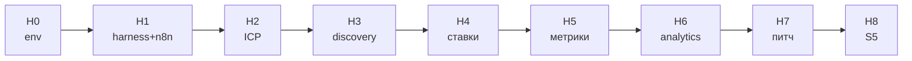
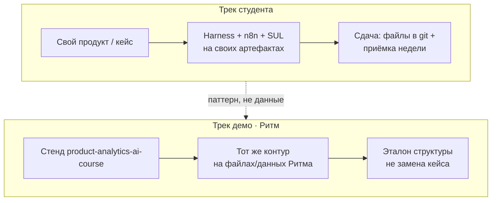
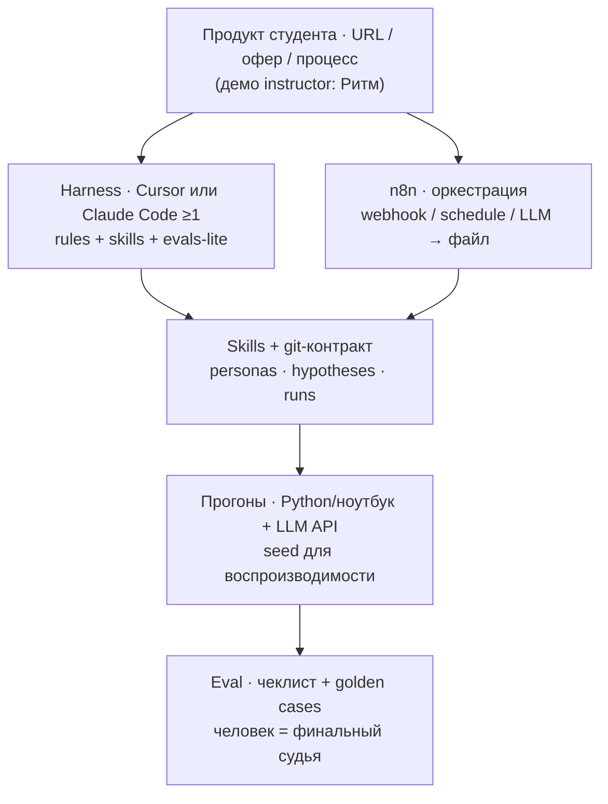
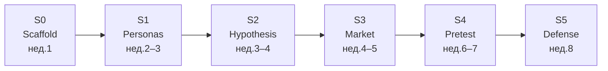

# AI для продакта — программа и план материалов

Рабочий план сиквела к курсам продуктовой / маркетинговой аналитики и статистики АБ.  
Опора по структуре: [ai4products.mlinside.ru](https://ai4products.mlinside.ru) (адаптируем, не копируем).  
Акцент: **много практики**; флагман — **агентная система синтетических пользователей** для гипотез, market sizing и оценки рынка.

---

## 1. Позиционирование относительно прошлых курсов

| Курс | Что закрывает | Чего не даёт | Как стыкуется с «AI для продакта» |
|---|---|---|---|
| **itmo-product-analytics** (`gavnukkk97/itmo-product-analytics`) | 8 недель: бизнес-вопрос → метрики → воронка → юнит → каналы/атрибуция → uplift → эксперимент; сквозной продукт «Лукошко» | AI-агенты, harness, делегирование продуктовой рутины | Пререквизит по мышлению «метрика → деньги → эффект». Не повторяем лекции про LTV/CAC — берём как язык артефактов агента |
| **product-analytics-ai-course** (`gavnukkk97/product-analytics-ai-course`) | Спираль ~8 нед., продукт **Ритм**, вехи P1–P4, SQL/Python с нуля, Metabase, AI как со-пилот кода | Сборка связанной AI-команды агентов; синтетические *пользователи* (не только синтетические *данные*) | Стенд **Ритм** — демо преподавателей. Здесь AI становится **исполнителем процесса**; студент тянет **свой продукт** |
| **stats-ab-course** (`gavnukkk97/stats-ab-course`) | Стат → АБ → байес → каузал; урок **4.6 AgentA/B** (симуляция персон до живого теста) | Продуктовый discovery, ICP, стратегия, коммуникации, агентный harness + n8n | Теоретический и этический фундамент флагмана: синтетика ≠ живой трафик |

**Одна фраза позиционирования:** прошлые курсы учат *считать и решать по данным*; этот — *собрать AI-контур продакта* (harness + n8n), которому можно делегировать research → гипотезы → экономику → аналитику → питч, с обязательной человеческой приёмкой — и **построить агентный претест гипотез на синтетических пользователях** на своём продукте.

**Анти-скоуп (чтобы не размазать):**

- не повтор JTBD/юнит/АБ «с нуля» (ссылки на прошлые репо);
- не курс «автопостинг в Telegram / контент-завод» — n8n в ядре как **оркестрация продуктовых процессов и SUL**, не как SMM-туториал;
- не промпт-сборник;
- облака Mail.ru / Яндекс — **только private ops reference** для производства (см. §4.3); студентам и в маркетинг курса не отдаём и не рекламируем.

**Аудитория:** продакты и аналитики, уже прошедшие (или эквивалент) продуктовую аналитику + базовый АБ. Код писать не обязательно; нужны терминал/файлы, понимание метрик, доступ к **своему продукту** (или чёткому рабочему кейсу автоматизации).

**Формат (зафиксировано):** **8 недель**, объёмный solid-курс; ~7 живых занятий × ~1,5 ч + **практика 4–6 ч/нед.**; флагман доводится до **S5**.

---

## 2. Модули / недели (backbone референса + practice spine)

Сквозной путь:  
**агентное рабочее место (+ n8n) → клиент/рынок → discovery → AI-ставка → метрики/экономика → аналитика → коммуникация → защита SUL.**

Правило продукта: студент ведёт **свой продукт / рабочий кейс** (payoff = автоматизация на работе). Параллельно преподаватели **демонстрируют на Ритме** (стенд из `product-analytics-ai-course`).

| Нед. | Занятие (адапт. MLinside) | Практика недели (обязательная) | Артефакт | Демо на Ритме (instructor) |
|---|---|---|---|---|
| **0** *(async)* | Онбординг: env, LLM-доступ, договор «AI ≠ вывод», выбор своего продукта | Поднять Cursor **или** Claude Code (второй — по желанию); n8n local/cloud; README своего кейса | Env + 1-pager своего продукта | Тур по стенду Ритма |
| **1** | **AI-экзоскелет:** fluency ≥1 harness (Cursor / Claude Code), контракт процесса, evals-lite, MCP; **n8n в ядре** — первый workflow (webhook/файлы → артефакт) | Агент «бэклог → статус» в harness; n8n-pipeline «триггер → LLM-шаг → файл/таблица»; старт SUL scaffold на **своём** репо | Harness + 1 skill + 1 n8n flow + S0 | Тот же flow на файлах Ритма |
| **2** | **Клиент, ICP, конкуренты, УТП** | Research pack по **своему** продукту; банк персон (10–20) | ICP + карта + v0 персон (S1 старт) | ICP «Ритм» как эталон структуры |
| **3** | **Discovery + упаковка** (Минто) | Гипотезы X→Y→Z по своему продукту; evidence-папка; red-team; n8n: сбор сигналов → сводка | 5–7 гипотез + brief (S2 старт) | Discovery brief на Ритме |
| **4** | **AI-ставки и стратегия** | 3 ставки по своему продукту; synthetic market sizing на персонах | Strategy memo + sizing (S3) | Go/no-go memo на Ритме |
| **5** | **Дерево метрик, юнит, финмодель** | Дерево/unit/сценарии на **своих** числах (или честных допущениях); агент считает, человек калибрует | Дерево + unit + 3 сценария | Эталон дерева Ритма |
| **6** | **Аналитика с агентом:** bare vs rich | Rich-пакет под **свой** продукт; funnel + feedback; n8n: регулярный digests | Контекст-пакет + 2 сценария; S4 старт | Bare vs rich на данных Ритма |
| **7** | **Коммуникации** + претест | Питч стейкхолдеру своего кейса; спарринг с ИИ-ЛПР; прогон претеста ≥50–100 агентов (S4) | Дек + отчёт симуляции | Питч-эталон + претест на лендинге Ритма |
| **8** | **Капстоун / S5** | Дожим SUL; калибровка vs известный кейс; взаимный разбор; честный раздел «где врёт» | v1 SUL + защита S5 | Разбор эталонной защиты на Ритме |

Календарные варианты A/C **сняты** — работаем только по этой 8-недельной сетке.

---

## 3. Флагманская практика: Synthetic User Lab (полная глубина S0→S5)

### 3.1. Что студент собирает

**Synthetic User Lab (SUL)** — репозиторий + n8n-контур на **своём продукте**:

1. Банк персон (сегмент, JTBD, ограничения, каналы).  
2. Сценарии поведения под гипотезы своего продукта.  
3. Between-subject претест (A/B или «оффер / нет»).  
4. Метрики: конверсия, WTP-proxy, qualitative themes.  
5. Decision memo: поддерживает / опровергает / нельзя заключить без живых людей.  
6. Market sizing / eval: bottom-up + tornado по допущениям.

Преподаватели параллельно гоняют тот же конвейер на **Ритме** (эталон, не замена студенческого кейса).

Опора: AgentA/B (arXiv 2504.09723), урок 4.6 `stats-ab-course` — претест и приоритизация, не замена живому АБ.

### 3.2. Стек (зафиксировано)

| Слой | Ядро курса | Заметка |
|---|---|---|
| Harness | **Cursor и Claude Code** оба ок; студент обязан свободно владеть **≥1** | Модели/вендоры вторичны; учим процесс и контракт |
| Оркестрация / glue | **n8n в ядре** (триггеры, webhook, расписание, связка LLM↔таблицы/файлы/API) | Не SMM-курс; сценарии под discovery, сводки, запуск прогонов SUL |
| Skills / контракты | Skills + папки в git (`/personas`, `/hypotheses`, `/runs`, …) | Совместимо с pm-skills |
| Персоны и прогоны | Python/ноутбук + LLM API; seed для воспроизводимости | n8n может триггерить прогон |
| Продукт для теста | **Свой продукт студента** (URL/экраны/офер) | Instructor-демо: **Ритм** |
| Данные / метрики | CSV + Markdown-отчёты; опционально стык с аналитикой своего продукта | Ритм Postgres — только демо |
| Eval | Чеклист + ≥3 golden cases; человек — финальный судья | LLM-as-judge — доп. сигнал |

### 3.3. Вехи флагмана — все обязательны (полная глубина)

| Вехи | Неделя | Что должно работать | Критерий приёмки |
|---|---|---|---|
| **S0** Scaffold | 1 | Репо SUL + контракт + dry-run harness + **n8n flow #1** | README + оба контура зелёные |
| **S1** Personas | 2–3 | ≥15 персон, ≥3 сегмента, словарь полей | Нет «среднего пользователя» |
| **S2** Hypothesis runner | 3–4 | Гипотеза → план симуляции (шаблон без дыр в метрике) | 5–7 гипотез своего продукта |
| **S3** Market eval | 4–5 | Bottom-up sizing + tornado ×3 допущения | Числа с источниками допущений |
| **S4** Pretest A/B | 6–7 | ≥50–100 агентов, 2 варианта на **своём** артефакте | Отчёт + раздел валидности |
| **S5** Defense | 8 | Питч: что решили бы / чего не решили бы по симуляции | Рубрика: честность > «прокрас» |

MVP-урезки S0–S3 **не применяем** — цель курса: довести всех до S5.

### 3.4. Границы (обязательный слайд)

- Синтетический пользователь **смещён**.  
- Совпадение направления с живым тестом **не доказано** для домена студента.  
- Для: отбраковки гипотез, подготовки интервью, чувствительности рынка.  
- Не для: финального ship/kill без живых данных, если трафик позволяет.

---

## 4. Карта материалов → модули

### 4.1. Репозитории (легальная опора производства + студенческий эталон)

| Источник | Куда кормит | Как использовать |
|---|---|---|
| `itmo-product-analytics` | Нед. 5 | Шпаргалки метрик/юнита |
| `product-analytics-ai-course` | Нед. 0, 5–6; **демо Ритм** | PRODUCT_CONTEXT / data dictionary для instructor-демо; студенты копируют *паттерн*, не обязательно данные |
| `stats-ab-course` | S4–S5; нед. 3 | AgentA/B, decision rule — адаптация |

### 4.2. Референс-сайт

| Блок [ai4products.mlinside.ru](https://ai4products.mlinside.ru) | Наш модуль | Адаптация |
|---|---|---|
| 01 Экзоскелет | Нед. 1 | + n8n core + SUL S0 на своём репо |
| 02 ICP / конкуренты / УТП | Нед. 2 | Выход = банк персон своего продукта |
| 03 Discovery + презентация | Нед. 3 | Гипотезы → runner; n8n digests |
| 04 AI-ставки / стратегия | Нед. 4 | + market eval (S3) |
| 05 Дерево метрик / unit | Нед. 5 | Свои числа; Ритм — эталон |
| 06 Аналитика bare vs rich | Нед. 6 | Rich под свой продукт; демо на Ритме |
| 07 Коммуникации / питч | Нед. 7–8 | Защита SUL S4→S5 |

### 4.3. Облака — private production reference (ops only)

**Политика (зафиксировано):** шары Mail.ru / Яндекс **оставляем в треке производства**. Это **внутренние ops-материалы** для kir / авторов курса: идеи структуры, чеклисты, паттерны n8n/harness.  

- **Не** публиковать студентам, **не** класть в публичный репо курса, **не** упоминать в лендинге/маркетинге.  
- Пароли и доступы — **только у kir**.  
- В студенческие материалы попадает только то, что переписано своими словами / на легальных источниках (доки n8n, Cursor, Claude Code, arXiv, свои репо).

| URL | Что видно | Полезность для производства | Модули | Ops-статус |
|---|---|---|---|---|
| [mail VR5n/cCk4HB4Ew](https://cloud.mail.ru/public/VR5n/cCk4HB4Ew) | Make/n8n: агенты, MCP, память, GPT-ассистенты, ЦА/конкуренты в Sheets | Паттерны **n8n-ядра** и MCP | Н1, glue SUL | Private ref; доступ у kir |
| [mail HygR/wBbrVeLtx](https://cloud.mail.ru/public/HygR/wBbrVeLtx) | «ИИ для разработчиков» (архив) | Разбор после пароля kir | Н1 | Private; пароль у kir |
| [Ya PUM5PhUzOhfr_Q](https://disk.yandex.ru/d/PUM5PhUzOhfr_Q) | Вайб-кодинг «Ты программист, Гарри» | Онбординг ТЗ→прототип | Н0–Н1 | Private ref |
| [Ya S1V_FbVoJKNzYg](https://disk.yandex.ru/d/S1V_FbVoJKNzYg) | gconf vibe coding: Cursor, Claude Code, Lovable, n8n | Сильная опора Н1 + UI под SUL | Н1, Н4, SUL | Private ref |
| [mail JbRZ/4oceBR8Mq](https://cloud.mail.ru/public/JbRZ/4oceBR8Mq) | aipython.rar | По необходимости после пароля | — | Private; пароль у kir |
| [mail S2a8/YQV1sp9LU](https://cloud.mail.ru/public/S2a8/YQV1sp9LU) | AI-ассистент: n8n, API, вебхуки, внедрение | Паттерны ассистента → skills/n8n | Н1, Н7 | Private ref |
| [mail 2U5L/JHkkoJrNg](https://cloud.mail.ru/public/2U5L/JHkkoJrNg) | Михайлов АБ | Дубль `stats-ab-course` — брать из своего репо | S4–S5 | Private; не приоритет |
| [mail 795m/pVjBtvTmi](https://cloud.mail.ru/public/795m/pVjBtvTmi) | Stepik Python/SQL/ML | Пререквизиты — не ядро | — | Private; низкий приоритет |

### 4.4. Пробелы (писать самим — студенческая выдача)

1. **SUL starter kit** под свой продукт + хуки n8n.  
2. **Рубрика валидности** симуляции (S5).  
3. **Instructor playbook Ритм** (все демо недель).  
4. Студенческие тексты Н1: harness fluency + n8n core (без копипаста из облаков).  
5. Reading list из §6 / `external-materials.md`.

---

## 5. Зафиксировано (kir)

| Решение | Значение |
|---|---|
| Длительность | **8 недель** (вариант B), объёмный solid-курс |
| Harness | **Cursor и Claude Code** оба ок; fluency **≥1**; модели вторичны |
| n8n | **В ядре** (не bonus-only) |
| Флагман | Полная глубина **S0→S5**, без урезания до MVP |
| Продукт студента | **Свой продукт / рабочий кейс**; payoff = автоматизация на работе |
| Демо преподавателей | Параллельно на **Ритме** |
| Облака Mail/Ya | Оставить как **private ops reference**; не студентам, не в маркетинг; пароли у kir |

**Ещё не блокер, но уточнить при старте репо:**

- рабочее имя публичного GitHub-репо курса;  
- бренд/название на лендинге («AI для продакта» vs иное);  
- язык студенческих текстов (RU по умолчанию разумно; EN skills/термины as-is).

---

## 6. Внешние материалы (курация)

Полный каталог: [`external-materials.md`](./external-materials.md).  
Снапшоты: [`materials-snapshots/`](./materials-snapshots/).

| Модуль | Лучшие внешние опоры |
|---|---|
| **Н1 Экзоскелет + n8n** | [phuryn/pm-skills](https://github.com/phuryn/pm-skills) · [Claude for PMs (YT)](https://www.youtube.com/watch?v=bITUsUsrxjM) · [Agent Harness (Medium)](https://medium.com/design-bootcamp/why-should-pm-care-about-agent-harness-5e4a5ae5a1ee) · [MCP](https://modelcontextprotocol.io/docs/getting-started/intro) · офиц. docs n8n |
| **Н2 ICP / рынок** | Discovery agent stack (Medium) · pm-skills market-research · Synthetic users YT |
| **Н3 Discovery** | [voice-of-agents](https://github.com/blakeaber/voice-of-agents) · [6 способов AI для PM](https://www.youtube.com/watch?v=ET3z8wSNUiA) |
| **Н4 AI-ставки** | [SSR paper](https://arxiv.org/abs/2510.08338) · [synthetic-market-research](https://github.com/BayramAnnakov/synthetic-market-research) |
| **Н5 Метрики** | pm-skills analytics · свои репо |
| **Н6 Аналитика-агент** | Medium AI Agents for PMs · эталон rich-контекста Ритма |
| **Н7–8 Питч / S5** | pm-skills GTM · [AgentA/B](https://arxiv.org/abs/2504.09723) · [SimAB](https://arxiv.org/abs/2603.01024) |

**Студентам:** GitHub MIT + arXiv + YouTube-ссылки + пересказ Medium. Облака §4.3 — только ops.

---

## Следующий шаг производства

1. SUL scaffold (S0) + n8n flow #1 под шаблон «свой продукт».  
2. Instructor playbook демо на Ритме (нед. 0–8).  
3. Контент нед. 1 (harness fluency ≥1 + n8n core) и S1.  
4. Вшить reading list §6 в недели.  
5. Private ops: kir держит доступы к облакам; авторы курса вытягивают паттерны → переписывают в легальные студенческие материалы.
